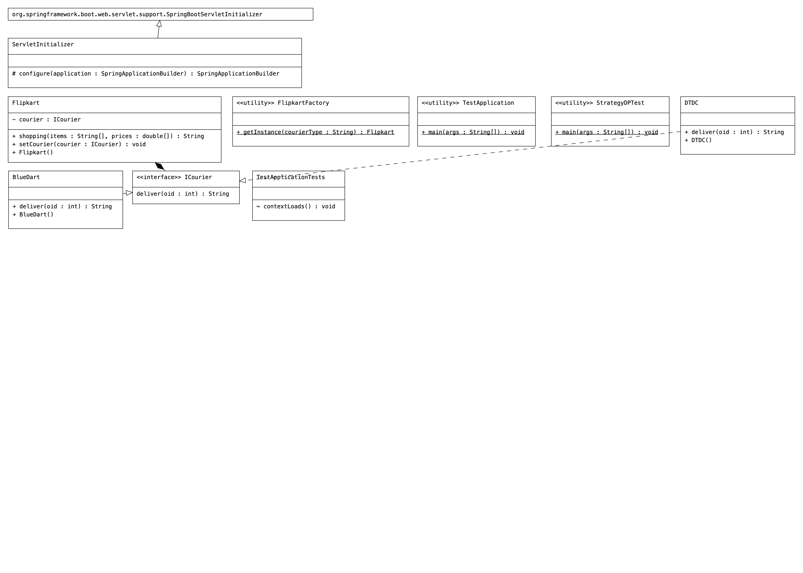

# Code
```Java
package com.courier;

import org.springframework.boot.SpringApplication;
import org.springframework.boot.autoconfigure.SpringBootApplication;

@SpringBootApplication
public class TestApplication {

    public static void main(String[] args) {
        SpringApplication.run(TestApplication.class, args);
    }

}
```

```Java
package com.courier.client;

import com.courier.comps.Flipkart;
import com.courier.factory.FlipkartFactory;

public class StrategyDPTest {
    public static void main(String[] args) {
        Flipkart fpkt = FlipkartFactory.getInstance("bDart");
        String resultMsg = fpkt.shopping(new String[]{"shirt", "trouser"}, new double[]{2000.0, 5000.0});
        System.out.println(resultMsg);

    }
}

```

```Java
package com.courier.comps;

public final class BlueDart implements ICourier {

    public BlueDart() {
        System.out.println("BlueDart:: 0-param constructor");
    }

    @Override
    public String deliver(int oid) {

        return "BlueDart courier is ready to deliver " + oid + " order number  products ";

    }

}

```

```Java
package com.courier.comps;

public final class DTDC implements ICourier {

    public DTDC() {
        System.out.println("DTDC:: 0-param constructor");
    }

    @Override
    public String deliver(int oid) {

        return "DTDC courier is ready to deliver " + oid + " order number  products ";

    }

}

```

```Java
//Flipkart.java
package com.courier.comps;

import java.util.Arrays;
import java.util.Random;

public final class Flipkart {
    //HAS- property
    private ICourier courier;

    public Flipkart() {
        System.out.println("Flipkart:: 0-param constructor");
    }

    //setter method for assignment
    public void setCourier(ICourier courier) {
        System.out.println("Flipkart.setCourier()");
        this.courier = courier;
    }

    //b.method
    public String shopping(String[] items, double[] prices) {
        System.out.println("Flipkart.shopping()");
        //calculate bill amount
        double billAmt = 0.0;
        for (double p : prices) {
            billAmt = billAmt + p;
        }
        //generate order id randomly
        int oid = new Random().nextInt(100000);
        // deliver the order using couier
        String msg = courier.deliver(oid);
        return Arrays.toString(items) + "are shopped having bill amount::" + billAmt + " --->" + msg;
    }


}
```

```Java
package com.courier.comps;

public interface ICourier {
    String deliver(int oid);
}
```

```Java
package com.courier.factory;

import com.courier.comps.BlueDart;
import com.courier.comps.DTDC;
import com.courier.comps.Flipkart;
import com.courier.comps.ICourier;

public class FlipkartFactory {

    //static  factory method
    public static Flipkart getInstance(String courierType) {
        // create one of the dependent class obj based on the given courier tyoe
        ICourier courier = null;
        if (courierType.equalsIgnoreCase("dtdc"))
            courier = new DTDC();
        else if (courierType.equalsIgnoreCase("bDart"))
            courier = new BlueDart();
        else
            throw new IllegalArgumentException("Invalid courier type");
        //create the target class object
        Flipkart fpkt = new Flipkart();
        fpkt.setCourier(courier);  //assiging the dependent to target
        return fpkt;

    }

}
```


# dependencies
```xml
	<dependencies>
		<dependency>
			<groupId>org.springframework.boot</groupId>
			<artifactId>spring-boot-starter-web</artifactId>
		</dependency>
		<dependency>
			<groupId>org.projectlombok</groupId>
			<artifactId>lombok</artifactId>
			<optional>true</optional>
		</dependency>
		<dependency>
			<groupId>org.springframework.boot</groupId>
			<artifactId>spring-boot-starter-tomcat</artifactId>
			<scope>provided</scope>
		</dependency>
		<dependency>
			<groupId>org.springframework.boot</groupId>
			<artifactId>spring-boot-starter-test</artifactId>
			<scope>test</scope>
		</dependency>
	</dependencies>
```
# UML
